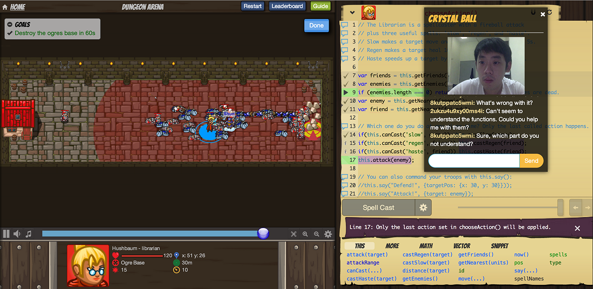

codecombat-webrtc
=================

This is quick demo hacked together to demonstrate how Crystal Ball, a WebRTC Communication Widget for CodeCombat Players can be used for CodeCombat. Crystall Ball uses a high-level WebRTC library called [PeerJS](http://peerjs.com/).

Quickstart
==

To run the demo, clone this repository and run:

    $ python -m SimpleHTTPServer

Next, navigate to [http://localhost:8000/]([http://localhost:8000/) in Chrome browser. Open two tabs. You will see the following screen:

Click on the Crystal Ball, copy your generated Peer ID, and paste it in the **Friend's Peer ID** input field of the other tab, and click **Start**. 

A WebRTC session will initiate. Allow the site to access your camera and microphone in both tabs. Start chatting away!

Notes
== 

- The Crystal Ball can be shifted around freely.
- Click on the Crystal Ball to open the chat/video window. Click on the x at the top-hand corner to hide the window and revert it back to a crystal ball.
